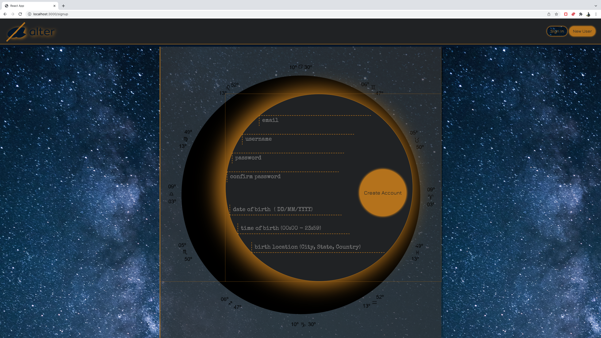

# alter

alter is a human connection platform that employs the major
planetary positions of a user’s western astrological natal chart
as a basis for relational curation. By analyzing user-provided
birth information, alter generates a profile that assings each
of the system's eleven primary celestial bodies one of 12 possible positions. These paired elements, of what is
traditionally refered to as a user's birth chart, then allow the
user to narrow their exposure to other members of the network by
filtering them through their preferred partner configurations.
This differentiates each user as 1 in 12 to the 11th power or 1
in 743 billion possible profile configurations, equipping every
user with just one more tool in the process toward willfull
relational pairing.

## Initial setup

### Install frontend dependencies

1. Open a new terminal
2. Navigate to the server folder `cd server`
3. Install the required packages `yarn install`
4. Start server `yarn start`

#### Install the backend dependencies

1.  Open a second terminal
2.  Navigate to the server folder `cd server`
3.  Install the required packages `yarn install`
4.  The app will require a .env file in the server folder containing the following API keys/secrets:

        MONGO_URI=<enter-string-here>
        OPENCAGE_API_KEY=<enter-string-here>
        ASTRO_API_KEY=<enter-string-here>
        CLOUDINARY_API_KEY=<enter-string-here>
        CLOUDINARY_API_SECRET=<enter-string-here>

5.  Start server `yarn start`

## Functionality

First, navigate to the New User page and enter the required information to generate natal chart data and move on to the the settings process.

Then, choose either one of the gender binary analogs or opt out (both for yourself and for preferred partners). From there, either select a position preference and unique priority values for each planet or opt out by choosing the default `Radical Alterity` submission. You must provide a bio with a maximum character value of 565 in order to submit preferences.

Once preferences are submitted, you are redirected to a home page now populated with user matches that correspond with your preferences. The home page shows users' major planet positions, their level of alignment with your preferences and bios. From there you can click on individual profiles to learn more or message them.

Once you send a message, the user profile contacted can also be accessed from ur inbox.

